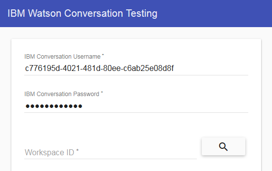

# IBM Watson Conversation Testing

[](https://bluemix.net/deploy?repository=https://github.com/davidroldan/watson-conversation-testing)

## Run the app locally

1. [Install Node.js][]
+ cd into this project's root directory
+ Run `npm install` to install the app's dependencies
+ Run `npm start` to start the app
+ Open the http link that you see in the command line (Example: <http://localhost:6001>) to a browser to access the app.

## Using this app

1. Retrieve the credentials from your Watson Conversation service. On Bluemix, click on your Conversation service, then click on the **Service credentials** tab, then click on **View credentials**:
    
    
    
    You should see a JSON object, as in this example:
    
    ```JSON
    {
      "url": "https://gateway.watsonplatform.net/conversation/api",
      "username": "c776195d-4021-481d-80ee-c6ab25e08d8f",
      "password": "xljfFf7vFnfc"
    }
    ```
    
2. Input your username and password on the app:

    
	
3. Get your Workspace ID by either using the Watson Conversation Tool or by using the **search** icon in the app.

    
    
4. Upload a CSV file with a single column of sentences, and press the **upload** icon. After the app processes all the sentences, a grid and a CSV download button will appear.

    
    
5. Using the advanced options, you can customize the input and the output of the tests.

    
    
## License

This app is licensed under the [Apache 2.0 license][license].

[Install Node.js]: https://nodejs.org/en/download/
[license]: http://www.apache.org/licenses/LICENSE-2.0